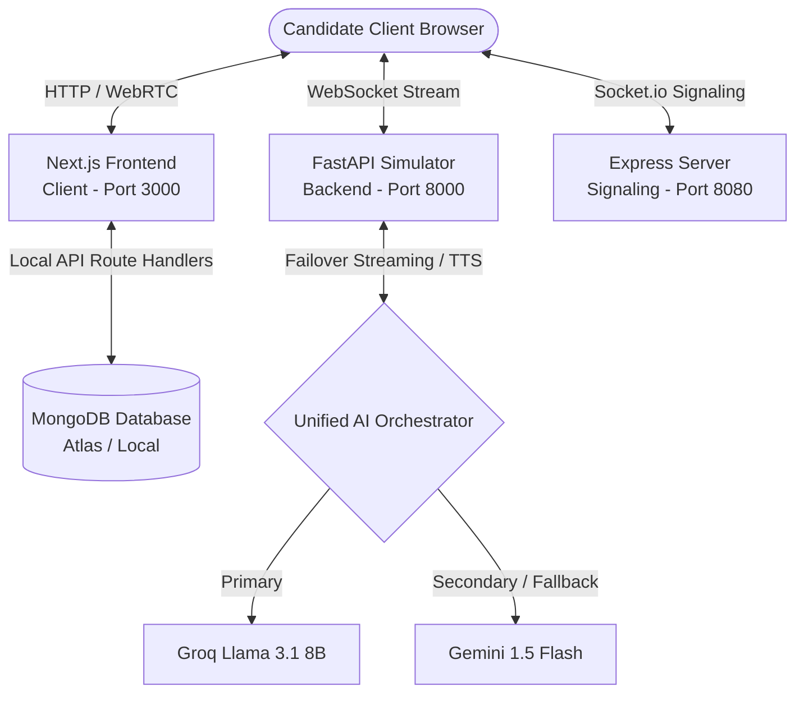

# 🎯 InterviewOS v2 — Production AI Placement Simulation Suite

InterviewOS is an ultra-premium, production-grade AI tech interview and collaborative group discussion simulation suite designed to prep candidates for elite placements. Featuring real-time WebSocket audio/text streams, visual voice activity indicators, high-fidelity Monaco-style code editors, WebRTC-powered peer rooms, and dynamic weakness-tracking memory, InterviewOS provides a hyper-realistic evaluation environment.

---

## 🏗️ Architecture & System Design



---

## 🛠️ The Tech Stack

### 🖥️ Frontend (Next.js App Router)
- **Framework**: Next.js 15 (React 18, TypeScript)
- **Styling**: Tailwind CSS v4 & custom glassmorphism systems
- **Animations**: Framer Motion for smooth state-driven micro-interactions
- **Charts & Statistics**: Recharts (dynamic `LineChart` and `BarChart` progression charts)
- **Code Editor**: Monaco-style editor (`@monaco-editor/react`)
- **State Management**: Zustand lightweight global reactive store
- **Audio Capture**: Custom `MixedAudioRecorder` for tracking local microphone inputs and AI speech outputs

### ⚙️ Backend Services (FastAPI + Node.js Socket)
- **Simulation Server (FastAPI)**: Runs on port `8000`. Manages the real-time AI conversation WebSocket stream (`/ws`) and integrates LLMs (Groq Llama-3.1 & Gemini 1.5 Flash).
- **Collaboration Server (Express + Socket.io)**: Runs on port `8080`. Handles WebRTC signaling and peer connections for custom candidate practice classrooms (`/room`).
- **Database**: MongoDB (stores user credentials, uploaded resumes, completed session logs, and analytics).

---

## 🤝 Collaborative Mock Rooms (WebRTC & Socket.io)

InterviewOS supports real-time peer-to-peer collaboration classrooms, enabling candidates to practice with peers or mock interviewers:
- **P2P Audio/Video Streaming**: Transmits media streams directly between browser peers using WebRTC (`RTCPeerConnection`).
- **Signaling Server**: An Express & Socket.io server running on port `8080` mediates handshakes, SDP exchange (`offer` / `answer`), and connection candidates (`ice-candidate`).
- **AI Suggested Prompts**: Synchronizes challenge prompts in real-time. Peers can choose a topic and click **Suggest Mock Question** to request a dynamic, challenging question from the Llama 3 / Gemini orchestration engine.
- **Hardware Scanner**: Features a pre-call volume amplitude graph that checks the user's mic input status using the Web Audio API.

---

## 📄 Smart Resume Parsing & Role Alignment

The application leverages a robust text-scanning parsing engine that extracts structures directly from uploaded resumes (PDF, DOCX, or TXT):
- **Role Detection**: Scans the header and top lines of the resume for standard job titles (e.g., *Frontend Developer*, *AI/ML Engineer*, *DevOps Engineer*). If none is found, it automatically infers a target role based on the matched technology domains.
- **Skill Extraction**: Parses technical keywords and categorizes them into specialized domains (MERN, Frontend, Backend, DevOps, System Design, AI/ML).
- **Personalized Recommendations**: The Command Center dashboard avoids displaying random topics. Instead, it provides a **"RUN_RESUME_SETUP"** shortcut. Clicking this pre-fills the technical interview configuration with the exact role and primary skills parsed from your resume and jumps straight to the configuration settings page.

---

## 📁 Repository Directory Layout

```
InterviewOS/
├── backend/            # FastAPI Simulator Backend (WebSocket & AI routing)
│   ├── app/
│   │   ├── ai/        # Groq & Gemini API integrations and failover routing
│   │   ├── api/       # WebSocket interview endpoint
│   │   ├── core/      # Environment configuration settings
│   │   └── main.py    # Main Uvicorn startup file
│   └── requirements.txt
├── server/             # Node.js Express & Socket.io WebRTC signaling server
│   ├── index.js       # Main server entrypoint
│   └── sockets/       # Room signalling connection handlers
└── frontend/           # Next.js 15 Web Application
    ├── src/
    │   ├── app/       # Frontend page routes (Analytics, Resume, Setup, Rooms)
    │   ├── components/# Reusable UI elements, diagrams, grids, and sidebar blocks
    │   ├── hooks/     # Custom React hooks (speech logic, WS handlers)
    │   ├── lib/       # Audio utilities, speaker parsers, and profile configs
    │   └── store/     # Zustand state store
    └── package.json
```

---

## 💾 Database Configuration
InterviewOS stores data dynamically inside **MongoDB**. It can run using either a local instance or a **Cloud Database (MongoDB Atlas)**:

### 1. Using Cloud MongoDB (MongoDB Atlas) — Recommended
If you do not have MongoDB installed locally, you can use MongoDB's free cloud tier:
1. Register/Log in to [MongoDB Atlas](https://www.mongodb.com/cloud/atlas).
2. Create a free shared cluster (e.g., `Cluster0`).
3. Under **Security → Database Access**, create a user account with read/write privileges.
4. Under **Security → Network Access**, add IP `0.0.0.0/0` (allow access from anywhere) for development.
5. In your Cluster Dashboard, click **Connect** → **Drivers** and copy your Node.js connection string.
6. Open [frontend/.env.local](file:///d:/CATALOGUE/New%20folder/InterviewOS/frontend/.env.local) (create it from `.env.example`) and replace the `MONGODB_URI` value with your Cloud Atlas Connection URI:
   ```env
   MONGODB_URI=mongodb+srv://<username>:<password>@cluster0.xxxx.mongodb.net/interviewos?retryWrites=true&w=majority
   ```
   *(Be sure to replace `<username>` and `<password>` with the credentials you created in Step 3).*

### 2. Using Local MongoDB
- **URI**: `mongodb://localhost:27017/interviewos` (Default fallback in [frontend/.env.local](file:///d:/CATALOGUE/New%20folder/InterviewOS/frontend/.env.local))

### Database Schema Collections
- `users`: User credentials (names, encrypted emails, and hashed passwords)
- `resumes`: Parsed domain skill matrices, experience nodes, and projects
- `sessions`: Completed mock transcripts, score indices, and weak topic logs

---

## 🚀 Setup & Launch Instructions

To launch the full suite, open three separate terminal tabs in your project root and run the following services:

### 📡 Tab 1: FastAPI Backend Service
1. Navigate to the backend directory:
   ```bash
   cd backend
   ```
2. Create and activate a Python virtual environment:
   ```bash
   python -m venv venv
   # On Windows:
   venv\Scripts\activate
   # On macOS/Linux:
   source venv/bin/activate
   ```
3. Install dependencies:
   ```bash
   pip install -r requirements.txt
   ```
4. Copy the environment file template and insert your API keys:
   ```bash
   copy .env.example .env
   ```
   Add your `GROQ_API_KEY` and `GEMINI_API_KEY` to the `.env` file.
5. Start the Uvicorn application server:
   ```bash
   uvicorn app.main:app --reload --port 8000
   ```
*Runs on [http://localhost:8000](http://localhost:8000)*

### 🤝 Tab 2: WebRTC Collaboration Signaling Server
1. Navigate to the server directory:
   ```bash
   cd server
   ```
2. Install dependencies:
   ```bash
   npm install
   ```
3. Start the WebRTC signaling Express server:
   ```bash
   npm start
   ```
*Runs on [http://localhost:8080](http://localhost:8080)*

### 💻 Tab 3: Next.js Frontend App
1. Navigate to the frontend directory:
   ```bash
   cd frontend
   ```
2. Install dependencies:
   ```bash
   npm install
   ```
3. Copy the environment file template:
   ```bash
   copy .env.example .env.local
   ```
   Ensure `MONGODB_URI` and `JWT_SECRET` are correctly configured.
4. Start the local development web server:
   ```bash
   npm run dev
   ```
*Runs on [http://localhost:3000](http://localhost:3000)*

---

## 🔑 Authentication & Login Flow

The platform uses a dynamic database registration mechanism with JWT-based session tokens:

1. **Start MongoDB**: Ensure your local MongoDB server is running on port `27017` or Atlas cluster is open.
2. **Register**: Access the portal at `http://localhost:3000`, head to the `/signup` screen, and enter your details to create an account. This hashes your password securely and registers you inside the `users` collection.
3. **Login**: Go to `/login` and enter your newly created credentials.
4. **Active Session**: A JWT is signed and set as an HTTP-only secure cookie, unlocking the protected areas (`/resume`, `/interview`, `/analytics`, `/room`).

---

## 💡 Troubleshooting & FAQ

### ⚠️ Error: `POST /api/session/save HTTP/1.1 404 Not Found` in Uvicorn console
- **What is happening?**
  The frontend client is sending a session save post to `/api/session/save`. This is a **Next.js server-side route handler** implemented inside `frontend/src/app/api/session/save/route.ts` to perform Gemini scoring and write results to MongoDB.
  If this request is arriving at port `8000` (FastAPI), it means:
  1. Your frontend is loaded or requesting paths on port `8000` instead of port `3000`.
  2. You have a proxy/reverse-proxy configuration (like Nginx) routing Next.js API requests to FastAPI.
- **How to resolve?**
  - **Always access the client-side app at [http://localhost:3000](http://localhost:3000)**.
  - Ensure no proxy intercepts Next.js specific routes: `/api/session/*`, `/api/auth/*`, `/api/resume/*`, or `/api/analytics`. These routes are fully managed on port `3000` by the Next.js runtime.

### 🎤 Microphone / Webcam Diagnostic Failures
- The app checks for webcam and microphone permissions prior to starting sessions. Ensure browser site permissions permit access on `http://localhost:3000`.
- The system includes a front-facing camera constraint fallback for mobile browsers and standard laptop standbys.

### 🔄 Dual-Provider AI Fallback
- If the primary provider (e.g. Groq) encounters an API limit or goes offline, the `ai_service.py` coordinator automatically falls back to Gemini 1.5 Flash. Ensure both keys are configured in the `backend/.env` file to prevent system outages.
